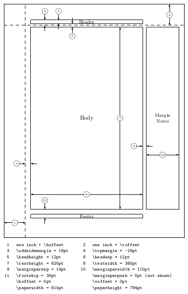
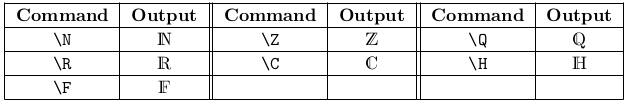
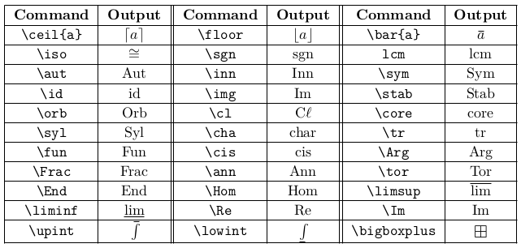

# latex-dev
A repository of LaTeX development

## Homework Document Class (v0.04)
The Homework document class, `mathhw.cls`, is designed with the graduate student in mind. LaTeX has a sharp learning curve, and although I believe any serious mathematicians today must develop a working knowledge of LaTeX, I also believe it should be easy for someone to get up and running creating beautifully typeset homework. 

This document class provides a comprehensive collection of mathematics packages and macros. It also applies the best practices regarding typography (see [here](http://tex.stackexchange.com/questions/71172/why-are-default-latex-margins-so-big) for some discussion on the matter). There are many other features, tweaks, and design choices contained within to help make this document class as useful and user-friendly as possible. Read below for detailed information.

### Installation

#### MiKTeX
Copy `mathhw.cls` to your local `texmf` directory and run "Refresh FNDB" in MiKTeX. For more detailed instructions, look [here](http://tex.stackexchange.com/questions/2063/how-can-i-manually-install-a-package-on-miktex-windows).

#### TeX Live
Copy `mathhw.cls` to your local `texmf` directory and run the following command in your command prompt/terminal as the super user:
```bash
texhash
```

For more detailed instructions, look [here](http://tex.stackexchange.com/questions/96976/install-custom-cls-using-tex-live-in-local-directory).

### Usage
To use this document class, simply start your LaTeX document with
```tex
\documentclass[<options>]{mathhw}
\myname{<Firstname Lastname>}
\coursetitle{<Name of course>}
\hwtitle{<Name of homework>}
```
The list of available options is provided below.

To save yourself from using the `\myname{}` command in every document, you can edit the `mathhw.cls` you copied to your system. Look for the line
```tex
\newcommand{\nm}{<First Last>} % <== REPLACE WITH YOUR NAME
```

### Packages
The following is a list if packages included in `mathhw.cls`.

- [`layout`](http://www.ctan.org/pkg/layout)
- [`geometry`](http://www.ctan.org/pkg/geometry)
- [`lmodern`](https://www.ctan.org/pkg/lm?lang=en)
- [`fontenc`](http://www.ctan.org/pkg/fontenc) (loaded with the *T1* option)
- [`inputenc`](http://www.ctan.org/pkg/inputenc) (loaded with the *utf8* option)
- [`mathtools`](http://www.ctan.org/pkg/mathtools)
- [`amsthm`](http://www.ctan.org/pkg/amsthm)
- [`amssymb`](https://www.ctan.org/pkg/amsfonts?lang=en)
- [`dsfont`](https://www.ctan.org/tex-archive/fonts/doublestroke?lang=en)
- [`mathrsfs`](http://www.ctan.org/pkg/mathrsfs)
- [`cancel`](http://www.ctan.org/pkg/cancel)
- [`enumitem`](http://www.ctan.org/pkg/enumitem) (loaded with the *shortlabels* option)
- [`array`](http://www.ctan.org/pkg/array)
- [`arydshln`](http://www.ctan.org/pkg/arydshln)
- [`relsize`](http://www.ctan.org/pkg/relsize)
- [`xcolor`](http://www.ctan.org/pkg/xcolor) (loaded with the *dvipsnames* option)
- [`tikz`](http://www.texample.net/tikz/)
- [`pgfplots`](https://www.ctan.org/pkg/pgfplots?lang=en)
- [`needspace`](http://www.ctan.org/pkg/needspace)
- [`todonotes`](http://www.ctan.org/pkg/todonotes)
- [`fancyhdr`](http://www.ctan.org/pkg/fancyhdr)
- [`parskip`](http://www.ctan.org/pkg/parskip) (loaded with the *parfill* option)
- [`hyperref`](http://www.ctan.org/pkg/hyperref)
- [`cleveref`](http://www.ctan.org/pkg/cleveref)
- [`framed`](http://www.ctan.org/pkg/framed)
- [`wasysym`](http://www.ctan.org/pkg/wasysym)
- [`lipsum`](http://www.ctan.org/pkg/lipsum)
- [`alphalph`](http://www.ctan.org/pkg/alphalph)
- [`pdfpages`](http://www.ctan.org/pkg/pdfpages)
- [`float`](http://www.ctan.org/pkg/float)
- [`tabularx`](http://www.ctan.org/pkg/tabularx)
- [`textgreek`](http://www.ctan.org/pkg/textgreek)
- [`upgreek`](http://www.ctan.org/pkg/upgreek)
- [`signchart`](http://www.ctan.org/pkg/signchart)
- [`microtype`](http://www.ctan.org/pkg/microtype)
- [`multicol`](http://www.ctan.org/pkg/multicol)
- [`tikz-cd`](http://www.ctan.org/pkg/tikz-cd)
- [`perpage`](http://www.ctan.org/pkg/perpage)
- [`listings`](http://www.ctan.org/pkg/listings)

### Class Options
#### fdefn
This option puts frames around the definitions
#### fthm
This option puts frames around the theorems
#### fnthm
This option puts frames around the enumerated theorems
#### darktheme
This option inverts the colors of the page, making the background black and the text white. This can be nice while editing to reduce eye strain.

### Behavior

#### Footnote Symbols
By default, whenever one uses the `\footnote{}` command, LaTeX automatically inserts a superscripted number as a reference to the footnote placed on the page. Since the intended use of this document class is writing mathematics, these numbers could cause confusion, as they look like exponents. To aleviate this potential confusion, the footnote numbers have been replaced by symbols that are rarely seen in mathematics.

#### Bold Math
By default, math input is not bolded, even when inside a `\textbf{}` command. I have overridden this behavior so that everything inside `\textbf{}` is bold.

#### Consolidated Proofs
If fewer than four lines of a proof can fit onto the bottom of a page, then the beginning of the proof will be pushed onto the next page.

### Page Layout
The default paper size for this document is **letter**. The layout for the page is set using the `geometry` package:
```tex
\geometry{
	headheight = 1.3em,
	headsep = 1.3em,
	marginparsep = 1.5em,
	footnotesep = 3em,
	hdivide={0.15\paperwidth,0.62\paperwidth,*},
	vdivide={0.1\paperheight,0.78\paperheight,*},
	marginparwidth=0.18\paperwidth
}
```


You will notice that all of the sizes are set relative to either the font size or paper dimensions. This is an intentional design choice so that the layout will look the same regardless of paper size or font selection. As noted in the discussion on [this StackExchange question](http://tex.stackexchange.com/questions/71172/why-are-default-latex-margins-so-big), the default margins in the article class are large so that the width of the text block is not too large. This helps the reader [comfortably read](http://baymard.com/blog/line-length-readability) the text without losing track of the line they are on. At the default 10 point font size, the number of characters per line should be at around 70 and never exceed 80.

I take some inspiration from a [Tufte-style book](http://www.latextemplates.com/templates/books/1/book_1_documentation.pdf) to move the body off-center to allow for a usable space for margin notes. The body height is slightly enlarged than the default so that more content can fit on a page without looking squeezed in.

### Tikz Libraries
Currently, `tikz` is loaded with the `shapes` and `arrows` libraries.

### Hyperlinks
The `hyperref` package is setup as such:
```tex
\hypersetup{
	colorlinks=true,
	linkcolor=blue,
	linkbordercolor=white,
	urlcolor=blue,
	unicode
}
```

### Math Macros
The following tables show the custom defined macros for accessing common math symbols and operators.

#### Double Stroke Characters


#### Functions and Operators


### Theorem-like Environments
Several theorem-like environments have been defined.

- **Theorem**: `\begin{thm}`, or for enumerated versions: `\begin{nthm}`
- **Lemma**: `\begin{lem}`, or for enumerated versions: `\begin{nlem}`
- **Proposition**: `\begin{prop}`, or for enumerated versions: `\begin{nprop}`
- **Corollary**: `\begin{cor}`, or for enumerated versions: `\begin{nlem}`
- **Definition**: `\begin{defn}`
- **Example**: `\begin{exmp}`
- **Solution**: `\begin{sol}`
- **Case**: `\begin{case}`
- **Note**: `\begin{note}`
- **Claim**: `\begin{claim}`

### Code Listings

The `listings` package is loaded for typesetting code listings. The `mathhw` class uses the following configuration:
```tex
\lstset{
	basicstyle = \ttfamily,
	showstringspaces = false,
	numbers = left,
	numberstyle = \tiny,
	numbersep = 5pt,
	frame = single
}
```

You can adjust or override this configuration using your own `\lstset`.

### Other Features

#### Circled text
I have included a command, `\circled{}`, which will place a nice circle/oval around the text in its argument.

#### Margin paragraphs
I have included a command, `\mpar{}`, which will format its argument as a margin note with small text size. I find that this smaller text is easier to read since it reduces the number of hyphenations and one-word lines.
